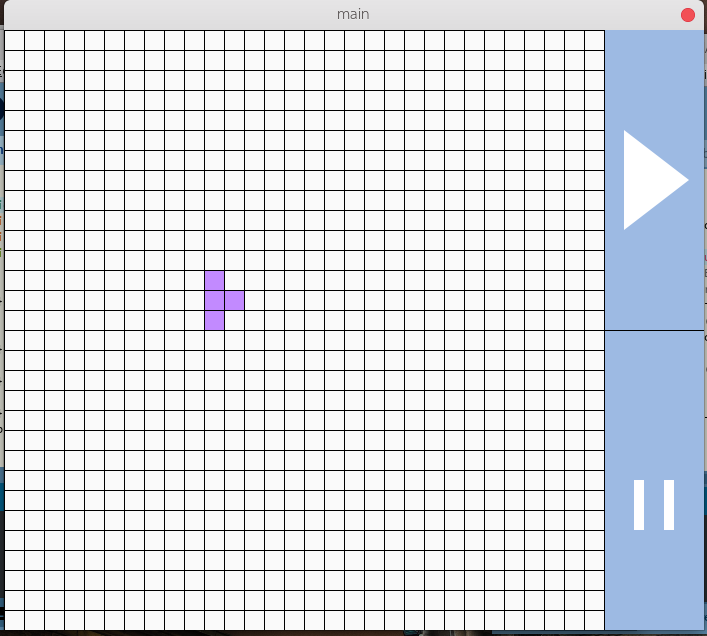
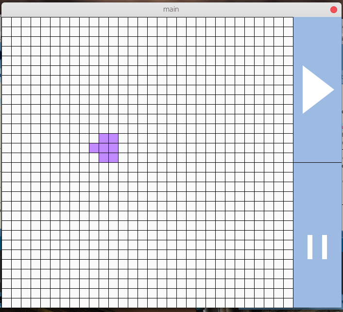
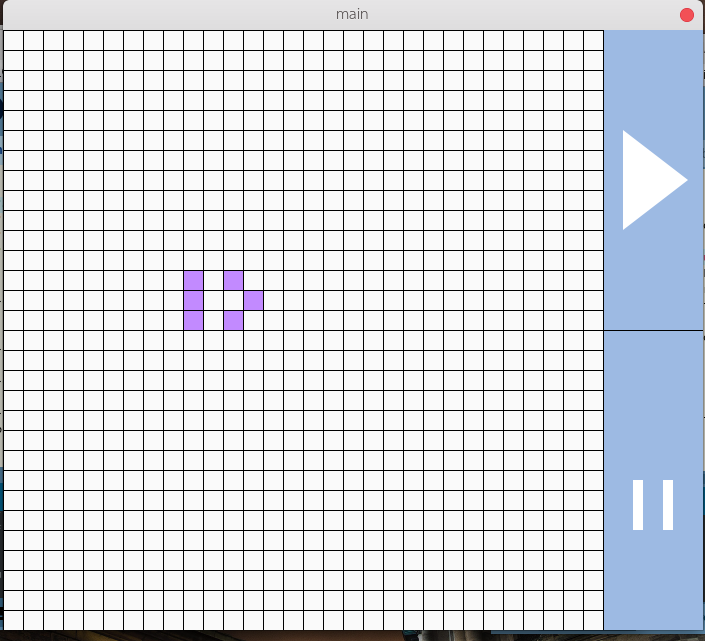
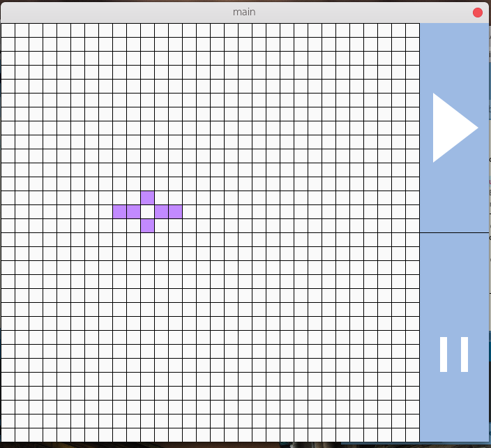
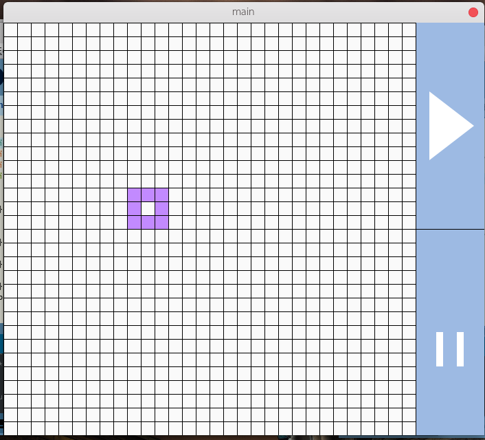
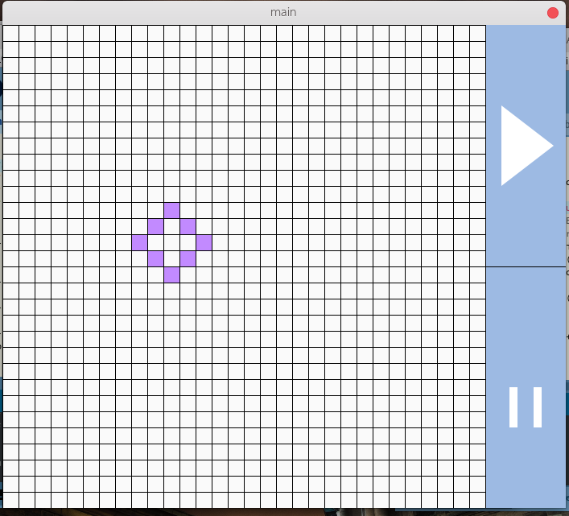
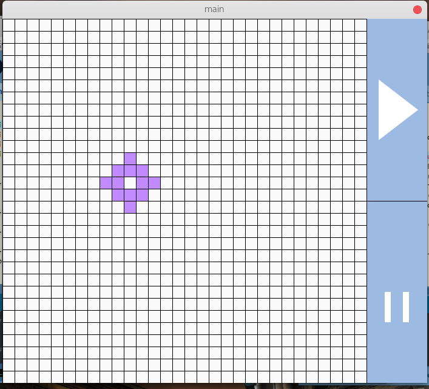
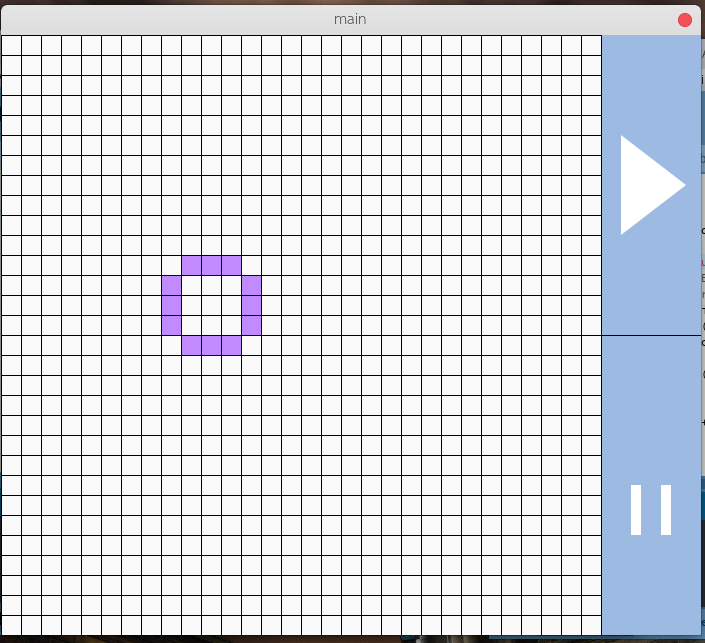
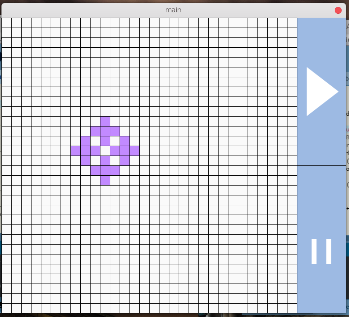
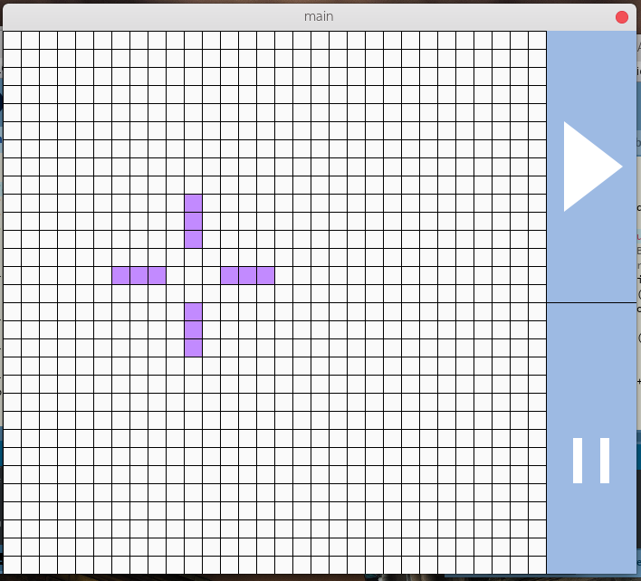

# Game of life by @fernandondin

A small representation of a Conway's 'Game of life' using java processing 4.0

| Example of an initial state becaming oscillator  |
|:---------------------------:|
|          |
|          | 
|          |
|          |
|          |
|          |
|          |
|          |
|          |
|         |
|         |

